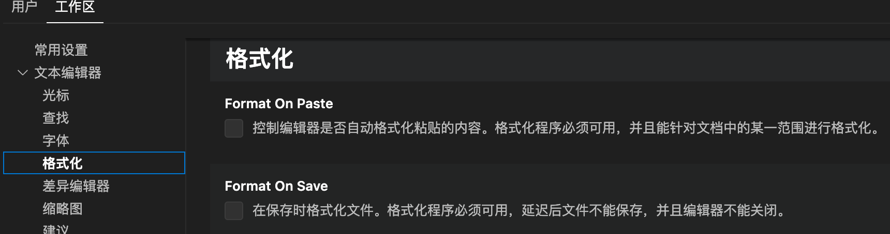

# Stellar_fontend

## Project setup
```
npm install
```

### Compiles and hot-reloads for development
```
npm run serve
```

### Compiles and minifies for production
```
npm run build
```

### Lints and fixes files
```
npm run lint
```

### Customize configuration
See [Configuration Reference](https://cli.vuejs.org/config/).

### fatfatshark
钱多润说，你们今天的面试情况不太理想，所以这个项目用到的技术栈很简单，vue2+vuex+vue-router+js+elementui，然后还可以用 echarts，nodev16.18.0,npmv8.19.2可以跑。这个张宝应该完全能看懂，你们不懂的就去问他，我是在他之前一个项目上稍微改了一下。axios 封装得很简单，你们如果有其他复杂应用的话再扩充吧，loading你们不需要可以删了，这里只是给你们演示请求拦截和响应拦截触发的时机。权限管理这块我不知道后端怎么设计的，所以没写。sidebar 这块，具体路由加在了 showplantform.vue 里。我还配了一下 eslint 和 prettier，你们 vscode 设置里勾选这两个应该就能用了
